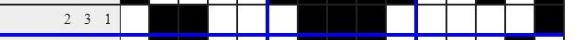

# Algorytm genetyczny rozwiązujący Nonogramy


## Konfiguracje

Do implementacji algorytmu skorzystałem z biblioteki [pyeasyga](https://github.com/remiomosowon/pyeasyga). Algorytm uruchamiałem w kilku różnych konfiguracjach wykorzystując zdefiniowane przez siebie różne funkcje fitness. Poniżej zestawienie tychże konfiguracji.

| Nazwa         | Wariant (funkcja fitness) | Liczebność populacja | Prawdopodobieństwo mutacji | Elityzm |
| ------------- | ------------------------- | -------------------- | -------------------------- | ------- |
| B-WholeLine   | BasicWholeLineVariant     | 200                  | 0.05                       | Tak     |
| B-EditDist    | BasicEditDistanceVariant  | 200                  | 0.05                       | Tak     |
| B-Diff        | BasicDiffsVariant         | 200                  | 0.05                       | Tak     |
| Ex-WholeLine  | ExtendedWholeLineVariant  | 200                  | 1                          | Tak     |
| Ex-Diff       | ExtendedDiffVariant       | 200                  | 1                          | Tak     |
| Ex-WholeLine2 | ExtendedWholeLineVariant  | 500                  | 1                          | Tak     |
| Ex-Diff2      | ExtendedDiffVariant       | 500                  | 1                          | Tak     |
| Ex-Diff3      | ExtendedDiffVariant       | 3000                 | 1                          | Tak     |

Najbardziej interesujące są warianty. Zdefiniowane są one w pliku [variants.py](variants.py).

## Warianty

### Reprezentacja chromosomu

Warianty zaczynające się od `Basic` wykorzystują reprezentację chromosomu w postaci 0/1 długości liczby pól nonogramu. 1 oznacza pole zamalowane, 0 - pole puste, a cały chromosom to zapis możliwego rozwiązania wiersz po wierszu.

Reprezentacja ta jest bardzo prosta, gdyż wykorzystuje domyślne funkcje mutujące z biblioteki.

Bardziej interesującą reprezentacją jest ta wykorzystana w wariantach zaczynających się od `Extended`. Koduje ona możliwe rozwiązanie jako listę długości liczby wierszy. Elementy tejże listy kodują poszczególne wiersze. Najlepiej zobrazuje to przykład. Taki wiersz:



 zostanie zakodoway jako:

```
[1, 2, 4, 0]
```

Pierwsza liczba oznacza, ile wolnych pól jest przed pierwszym zamalowanym polem. Ostatnia analogicznie ile jest niezamalowanych pól po ostatnim zamalowanym. Liczby w środku także oznaczają liczbę niezamalowanych pól pomiędzy kolejnymi zamalowanymi - są jednak pomniejszone o 1 (pomniejszenie o 1 wynika ze sposobu generowania nowych chromosomów, które opisuję poniżej).

Mając taką reprezentację oraz opis instancji nonogramu, jesteśmy w stanie jednoznacznie odtworzyć wygląd planszy. Implementacja takiego odtwarzania znajduje się w metodzie `NonogramConverter.convert_to_solution()` w pliku [converter.py](converter.py).

### Generowanie losowego chromosomu

O ile w przypadku reprezentacji `Basic` jest ono trywialne, o tyle w przypadku `Extended` już niekoniecznie. Istota problemu to generowanie losowej reprezentacji z jednakowym prawdopodobieństwem dla każdej.

Podczas pracy nad projektem dwukrotnie zmieniałem funkcję generującą. Rozpocząłem od następującej:

```python
def create_row(clue, width):
    if not clue:
	      return []
    c = np.array(clue)
    reserved = np.sum(c) + len(c) - 1
    left = width - reserved
    row = []
    row.append(random.randint(0, left))
    left -= row[-1]
    for _ in range(len(c)-1):
        row.append(random.randint(0, left))
        left -= row[-1]
    return row
```

Generowała ona rozmiary kolejnych przerw, jednak przez to dużo bardziej prawdopodobne były ustawienia, w których ostatnia zamalowana kratka była ostatnią w wierszu (było małe prawdopodobieństwo, że będzie odstęp od prawej strony).

Druga wersja losowała, którą przerwę "poszerzyć" aż suma długości przerw była odpowiednia:

```python
def create_row(clue, width):
    if not clue:
      	return []
    c = np.array(clue)
    reserved = np.sum(c) + len(c) - 1
    left = width - reserved
    row = [0  for _ in range(len(c)+1)]
    for _ in range(left):
        chosen = random.randrange(0, len(row))
        row[chosen] += 1
        return row[:-1]
```

Tutaj jednak dużo bardziej prawdopodobne były rozwiązania, które miały równomierny rozkład pomięzy przerwy.

Ostatecznie zaimplementowałem następującą funkcję `ExtendedVariant.create_row()` w pliku [variants.py](variansts.py):

```python
@classmethod
def create_row(cls, clue, width):
    if not clue:
        return []
    c = np.array(clue)
    reserved = np.sum(c) + len(c) - 1
    left = width - reserved
    return cls.create_repr(left, len(c)+1)

@staticmethod
def create_repr(left, length):
    row = [random.randint(0, left) for _ in range(length)]
    row.sort()
    result = []
    for prev, cur in zip([0, *row], [*row, left]):
        result.append(cur - prev)
    return result
```

Generuje ona losowo tyle liczb, ile ma być przerw. Każda liczba jest z zakresu od 0 do sumarycznej liczby pustych kratek w danym wierszu. Następnie wszystkie liczby są sortowane, a różnice pomiędzy nimi wyznaczają rozmiary przerw.

W tym podejściu nadal nie każda konfiguracja jest tak samo prawdopodobna, ale rozkład prawdopodieństwa jest bardziej wyrównany niż w poprzednich propozycjach. Potwierdziły to także uruchomienia na danych testowych.

### Funkcja fitness

Poszczególne warianty różnią się także zastosowaną funkcją fitness.

* `WholeLine` - w tej funkcji fitness liczone są ograniczenia, które nie zostały spełnione. Za każde odejmowany jest 1 punkt karny. Rozwiązanie optymalne będzie miało wartość 0, zaś najgorsze -(suma wysokości i szerokości nonogramu). 
* `EditDistance`  - funkcja ta konwertuje potencjalne rozwiązanie na opisy wierszy i kolumn, a następnie dla każdego wiersza i kolumny liczy odległość edycyjną pomiędzy opisem wygenerowanym, a oczekiwanym. Funkcja zwraca -(suma odległości). Optymalne rozwiązanie ma wartość 0, wszyskie inne zaś mają wartości ujemne. Funkcja ta jest mniej restrykcyjna, niż powyższa - bada podobieństwo poszczegónych wierszy i kolumn i zwraca wartości z większego zakresu niż $[0;1]$.
* `Diff - ` funkcja ta konwertuje wiersze i kolumny jak powyżej, jednak tym razem liczy sumę wartości bezwzględnych różnicy odpowiadających sobie elementów pomiędzy wygenerowanym napisem, a oczekiwanym. Jeśli któreś z napisów jest dłuższy to "wystające" elementy są również dodawane. Ostateczny wynik to -(suma wszystkich tak zdefiniowanych wartości). Ta funkcja jest najmniej restrykcyjna i najbardzie rozróżnia rozwiązania. Oczywiście optymalne rozwiązanie otrzymuje wartość 0.

```python
def fitness_one_line(expected, actual):
    min_len = min(len(expected), len(actual))
    value_diff = np.sum(np.abs(np.array(expected[:min_len]) - np.array(actual[:min_len])))
    missing_sum = sum(expected[min_len:])+sum(actual[min_len:])
    return -(value_diff + missing_sum)
```

Warto zauważyć, że w wariantach `Extended` wszystkie powyższe funkcje powinny zwrócić 0 podczas rozpatrywania wierszy, a liczyć będą się tylko punkty karne dla kolumn (to jedna z przewag reprezentacji `Extended`). 

### Mutacja i crossover

W wariantach `Extended` zastosowałem specyficzne operatory mutacji i crossover.

Podczas mutacj z pewnym prawdopodobieństwem następuje zastąpienie całego wiersza.

```python
@classmethod
def mutate(cls, individual):
    row_index = random.randrange(len(individual))
    old_repr = np.array(individual[row_index])
    individual[row_index] = cls.create_repr(np.sum(old_repr), len(old_repr))
```

Operator crossover jest zaś wielopunktowy - dla każdego wiersza losouje, z którego rodzica wybrać rozwiązanie.

```python
def crossover(parent_1, parent_2):
    child_1 = []
    child_2 = []
    for index in range(len(parent_1)):
        if random.randint(0,1) > 0:
            child_1, child_2 = child_2, child_1
            child_1.append(parent_1[index])
            child_2.append(parent_2[index])
    return child_1, child_2
```

## Dane testowe

Swoje rozwiązania zacząłem testować na nonogramie motyla ([butterfly.non](db/butterfly/butterfly.non)). Korzystałem także z przykładów z repozytorium [nonogram-db](https://github.com/mikix/nonogram-db). Niestety zawiera ona niewiele nonogramów, zwłaszcza tych o małych wymiarach. Skorzystałem więc tylko z formatu używanego tamże i napisałem własny generator losowy nonogramów. Znajduje się on w pliku [generator.py](generator.py). Jego uruchomienie wygląda następująco:

```bash
python generator.py istniejący_folder_docelowy wysokość szerokość liczba_nonogramów
```

Przykładowo:

```bash
python generator.py db/25x25 25 25 10
```

Za pomocą tego skryptu wygenerowałem po 10 nonogramów w rozmiarach:

* 5x5
* 5x10
* 10x5
* 10x10
* 15x15
* 20x20
* 25x25

## Uruchomienie

Aby uruchomić algorytm genetyczny należy wykonać plik [main.py](main.py). Jeśli podamy mu argument - ścieżkę do pliku `.non` to program rozpocznie rozwiązywanie nonogramu z podanego pliku.

```bash
python main.py db/butterfly/butterfly0.non
```

Na samym początku program wyświetli oczekiwany rezultat (wczytany z pliku `.non`). Następnie będzie działał wyświetlając postęp z użyciem biblioteki `tqdm`, aby na koniec wyświetlić znalezione rozwiązanie oraz wykres działania.

Kod tworzący wizualizacje obrazków znajduje się w pliku [visualize.py](visualize.py). Na wygenerowanym obrazku zastosowałem 2 stopniową skalę czerwieni obrazującą, czy dany wiersz bądź kolumna są poprawne czy nie.

### Porównanie

Jeśli podczas uruchomienia ścieżka nie zostanie podana, program uruchomi się w trybie porównania konfiguracji. Wygeneruje on wtedy raporty, które znajdują się już w katalogu `results`.

W trybie porównania algorytm genetyczny uruchamiany jest w konfiguracjach określonych przez zestawy na nonogramach z katalogu `db`.

| Kategoria | Liczba generacji | Zestaw konfiguracji |
| --------- | ---------------- | ------------------- |
| 5x5       | 30               | 1                   |
| 5x10      | 50               | 2                   |
| 10x5      | 50               | 2                   |
| 10x10     | 50               | 3                   |
| 15x15     | 50               | 4                   |
| 20x20     | 50               | 5                   |
| 25x25     | 50               | 5                   |
| butterfly | 100              | 6                   |

#### Zestaw konfiguracji 1

- [x] B-WholeLine 
- [x] B-EditDist 
- [x] B-Diff 
- [x] Ex-WholeLine 
- [x] Ex-Diff 
- [ ] Ex-WholeLine2 
- [ ] Ex-Diff2 
- [ ] Ex-Diff3 

#### Zestaw konfiguracji 2

- [x] B-WholeLine 
- [x] B-EditDist 
- [x] B-Diff 
- [x] Ex-WholeLine 
- [x] Ex-Diff 
- [ ] Ex-WholeLine2 
- [ ] Ex-Diff2 
- [ ] Ex-Diff3 

#### Zestaw konfiguracji 3

- [x] B-WholeLine 
- [x] B-EditDist 
- [x] B-Diff 
- [x] Ex-WholeLine 
- [x] Ex-Diff 
- [x] Ex-WholeLine2 
- [x] Ex-Diff2 
- [ ] Ex-Diff3 

#### Zestaw konfiguracji 4

- [ ] B-WholeLine 
- [ ] B-EditDist 
- [ ] B-Diff 
- [x] Ex-WholeLine 
- [x] Ex-Diff 
- [x] Ex-WholeLine2 
- [x] Ex-Diff2 
- [ ] Ex-Diff3 

#### Zestaw konfiguracji 5

- [ ] B-WholeLine 
- [ ] B-EditDist 
- [ ] B-Diff 
- [ ] Ex-WholeLine 
- [ ] Ex-Diff 
- [x] Ex-WholeLine2 
- [x] Ex-Diff2 
- [ ] Ex-Diff3 

#### Zestaw konfiguracji 6

- [ ] B-WholeLine 
- [ ] B-EditDist 
- [ ] B-Diff 
- [ ] Ex-WholeLine 
- [ ] Ex-Diff 
- [ ] Ex-WholeLine2 
- [x] Ex-Diff2 
- [x] Ex-Diff3 

## Wyniki

Aby zredukować losowość wyników, w każdej kategorii uruchomiłem różne konfiguracje na różnych nonogramach i wyciągnąłem średnią z ostatecznej wartości funkcji fitness. Dzięki temu można bezpieczniej porównywać różne konfiguracje, pamiętając jednak o wykorzystywanych przez nie różnych funkcjach fitness.


Warianty `Basic` już dla najmniejszych obrazków 5x5 nie zawsze znajdują optymalne rozwiązanie.


Słabość wariantów `Basic` potwierdza się także na większych obrazkach. Warianty `Extended` wypadają lekko gorzej, ale nadal staysfakcjonująco. Spodziewałem się jednak zauważalnej różnicy w działaniu na obrazkach 5x10 vs 10x5 wynikającej z reprezentacji chromosomu. Niczego takiego jednak nie widzę.


Dla obrazków 10x10 warianty `Basic` mocno odstają - przykładowo *B-WholeLine* nie jest w stanie spełnić średnio 12 wymagań (czyli np. żadna z kolumn oraz 2 wiersze nie są dopasowane). Możemy jednak zauważyć oczywisty fakt pomiędzy wariantami `Extended` 1 i 2 - te ze zwiększoną liczebnością populacji dają lepsze rezultaty.


Tutaj warto zaznaczyć, że funkcje fitness są liczone w różny sposób, więc warianty `Diff` niekoniecznie są gorsze (raczej jest wręcz odwrotnie).


Dla większych obrazków nawet lepsze warianty nie dają już satysfakcjonujący wyników.


Dla przykładu z motylem nawet zwiększenie populacji do 3000 nie pozwala znaleźć optymalnego rozwiązania.

Tak prezentują się zaś powyższe diagramy razem.


## Podumowanie

Algorytmy genetyczne mają duży potencjał i pozwalają na rozwiązywanie problemów, które są zbyt trudne dla klasycznych algorytmów. Dla nonogramów łatwo wyobrazić sobie brutalne rozwiązanie, które działa w czasie $O^*(2^{n \cdot m})$. Z pomocą techniki *meet-in-the-middle* moglibyś zapewne rozwiązać problem w czasie $O^*(2^{\frac{n \cdot m}{2}})$ . Jednak już dla obrazków 10x10 to rozwiązanie będzie zbyt wolne.

Z drugiej strony niewiele większe obrazki, tj. już 20x20 nie są w satysfakcjonujący sposób rozwiązywane przez algorytmy genetyczne. Nawet mniejsze nonogramy nie mają 100% rozwiązywalności przez algorytmy genetyczne. Dlatego nie jest to rozwiązanie idealne.

Osobiście byłem lekko zawiedziony, że moje implementacje nie były w stanie rozwiązać nonogramu z motylem. Najlepsze znalezione przez nie rozwiązanie miało funkcję fitness -2. Najlepsze rozwiązanie z wizualizacją, które udało mi się uchwycić miało funkcję fitness -4.


